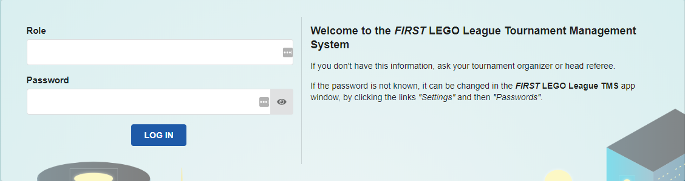
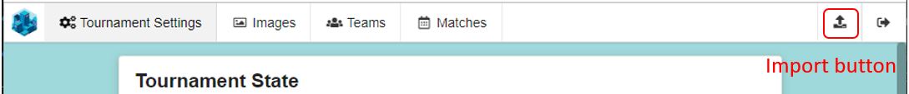
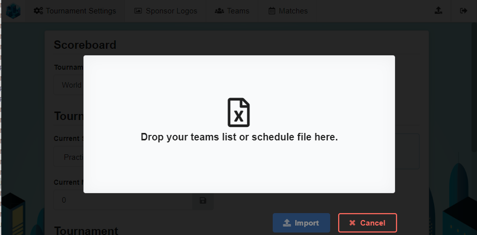
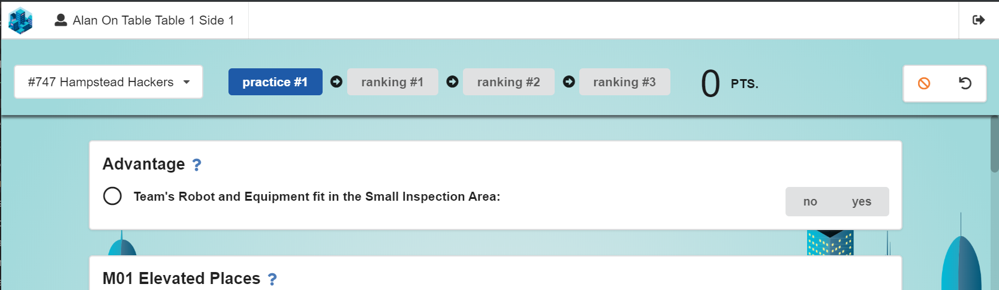
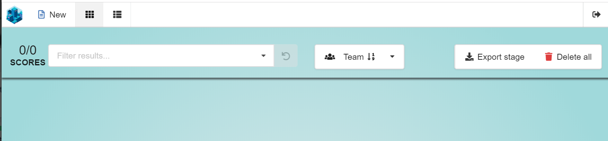
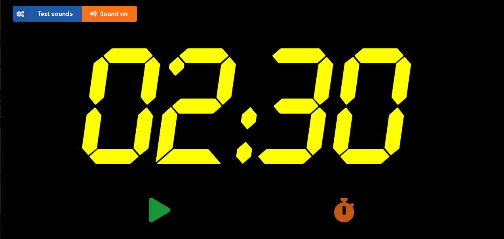

# *FIRST* LEGO League TMS Quick User Guide

Last Updated: 24-Jan-2020 for v2019.1.3

This guide is intended to be a quick HOW-TO guide to using the scoring software. It is a supplement to the [full *FIRST* LEGO League TMS User Guide](https://github.com/FirstLegoLeague/Launcher/blob/user-guide/docs/userguide.md)

## Launcher app

The `launcher` is used to open and configure the TMS modules.

 

### Home

- Timer module - start and stop the match timer.
- Scoreboard module - show all the teams and their scores.
- Scoring module - enter missions done by a team, and manage the scores of all the teams.
- Tournament Setup module - configure the tournament e.g. import a schedule file or team list.
- Status module - show how the tournament matches are progressing with respect to the tournament schedule.

Click the module title to open it in the Chrome browser.

### Settings

Configure general settings for modules

- Password - change default passwords for the four pre-defined roles.
- Scoring - change scoresheet language, and various other configurations.
- Advanced - set the IP address to be used.

## Logging in

All modules require you to log in with a passowrd. There are four pre-defined roles

- `admin` - tournament administrator or head referee. 
- Has access to all screens.
- Can delete all scores and tournament data
- Default password: admin-pass
- `scorekeeper` - transfers missions completed from paper scoresheets into the digital scoresheets. Can also view all scores entered so far.
- Has access to scoresheet, scores and Timer screens.
- Can export rankings but cannot delete all scores.
- Can use the `Set default values` and `Reset scoresheet` buttons.
- Default password: sk-pass
- `referee` - Records the state of the robot game on a digital scoresheet. Usually used on iPads or tablets.
- Only has access to the scoresheet.
- Does not have the `Set default values` or `Reset scoresheet` buttons.
- Default password: ref-pass
- `mc` - Accesses the Timer screen. Can start and stop matches.

It is strongly recommended that you change the default passwords.



## Tournament Setup

The `Tournament Setup` screen is the place where the tournament organizer or head referee sets up the tournament.

### Tournament Settings

Configure general settings for the tournament from the `Tournament Settings` screen.


- The `Tournament Title` shown on the `Scoreboard` is configured here.
- Use the `Current Stage` dropdown to set the current stage of the tournament. Most tournaments have `practice` and `ranking` stages.
  - When you import a `Schedule File` the stage names in the file are used.
  - Default stage names are used if you import a `Team List`.
  - Press the `Save` button after changing the stage. If scores have already been entered for the newly selected `Stage` they will appear on the `Scoreboard`.
- The `Current Match` is the match number of the match being played.
  - The `Current Match` starts at 0 and is automatically advanced when the `Timer` is started.
  - The current match is not advanced at `Timer` start if the previous timer was aborted.
  - Should you need to set the `Current Match` manually, enter a new value (or press the arrows) and then press `Save`.
- If your tournamet  have a non-default number of Practice or Ranking rounds, make the change in the `Number of rounds per stage` setting.
- The `Schedule offset` setting is used when you have imported a full schedule file, with match times, and your tournament is running behind schedule (e.g. snow days).
- `Delete Tournament Data` - Use the `Delete` button to delete the Teams and Matches.  You will be asked to confirm. **Note this is permanent and deleted data cannot be recovered**. The system will verify that there are no team scores before deleting teams or matches, which means that you will have to delete scores before deleting teams (and matches). You delete scores in the `Scoring` module.

### Sponsor Logos

The sponsor logos shown on the [Scoreboard](#Scoreboard) ribbon are configured here.


The five *FIRST* LEGO League global sponsors are preloaded. You can add additional images files by dragging and dropping an image file. Press the red trashcan button on an image tile to remove it.

### Import team information

The next step is to import a schedule file or team list. Click the `Import` icon at the top right of the screen and drag `Schedule File` or `Team List` file as indicated.

Note: `Import` is only available before teams have been imported.



- `Schedule file` - Import a CSV schedule file that follows the format of the Tournament Scheduler Excel spreadsheet. This file contains team numbers and names as well as the tournament matches time schedule.
- `Schedule file - shortened` - Import a CSV schedule file exported from one of the Excel-based `Team Tournament Schedule Templates` in the [_FIRST_ LEGO League Tournament Manual](https://firstlegoleague-eventmanuals.pbworks.com/w/page/85093483/Chapter%209%20Home%20Page). The templates can be downloaded from the Wiki. These CSV Export files do not contain match information, or table names. You will need to add table names afterward the import.
- `Team List` file - Import a plain CSV team list. The file must have the team number, team name and general information, such as team affiliation, in the first 3 columns. This file does not contain match information, or table names. You can add table names after you complete the import.

Drag and drop a schedule file or team list onto the popup.



Verify that the data looks correct and then press `Import`.

Once you have imported the file you can view the imported data by pressing the `Teams` and `Matches` buttons.

If you need to replace the imported data with a different CSV file, you can delete all the teams and matches, and import again.

### Teams

On the `Teams` screen you can edit the team name and affiliation, or delete a team. There is also a `New Team` button. Be sure not to use a team number that is already taken.

You can search for a team by number. Enter # and the team number in the search box. You can also search by team name.

### Matches

The `Matches` screen shows all the match information.


You can edit match information or delete a match. You can also [add a match](#+-match) or add, delete or rename the tables. Be careful not to enter conflicting data.

You can search for matches of a team by entering the number in the search box.

#### Manage Tables

Press the ```Manage Tables``` button to add or edit table names. (The button is at the top right side of the Matches screen). If you imported a schedule file, the table names will be those in the file. If you imported a shortened schedule file or team list, you can add the table names here.

## Scoring

The `Scoring` module is used by the `Referee` or `Scorekeeper` to complete a scoresheet and by the `Head Referee` or `Scorekeeper` to manage the scores already entered into the system.

- When logging in with the `Referee` role, you only have access to the scoresheets.
- When logging in with the `Scorekeeper` or `Admin` roles, you can also manage existing scores and scoresheets.

### Referee login

When you login as a `Referee` you see this screen.


Enter the referee name and select a table from the list and press `Save`. The referee scoresheet will be shown.



### Scoresheet

The scoresheet text follows the official scoresheet exactly.


- `Select Team` - Choose the team to score. After selecting a team, you select the `Round`.
- `Select Round` - Click the `Round` to score.
- `Points` shows the accumulated points of missions scored so far.
- `Default` sets all the unscored missions to their default (usually unscored) value.
- `No show` - mark a team that has missed their match as No Show
- `Reset` - reset the scoresheet to it's unscored state
- `Cancel` - closes the scoresheet without saving it
- `?` - Show the mission description.

Once all the scoring requirements of a mission have been marked, the mission score value is shown, and the accumulated points are updated.


The team signs the scoresheet in the space provided, and then press `Done`. You will see a `Score saved` notification.

### Scorekeeper or Admin login

When you login as `Scorekeeper` or `Admin` you see this screen.



The top line has four icons:

- New scoresheet -  opens a scoresheet as described in the referee [Scoresheet](#scoresheet).
- Score management view is used by the Head referee or Scorekeeper to view all the scores entered and to modify the team score information.
- Ranks view
- Logout

### Score mangement


- Buttons
  - Scores - shows the number of scores entered into the system and the number shown
  - Filter - you can filter scores by a large number of paramters -  Public / Valid / Duplicate / No-show / Team number / Stage / Round / Table / Referee
  - Sort order - order the scores by Team number / Match / Score / Last update time
  - Export stage - exports the  scores to a CSV file that can be used by Judging-Lite.
  - Delete all - delete all scores on the system. You will be asked to confirm. This button is only available when `admin` is logged in.

    **Note: this is permanent and deleted scores cannot be recovered**.

### Scoring tiles

All the information relating to a particular score is shown in a scoring tile.

#### Scoring tile  


- `Team number and name` - change the team to which this score is assigned.
- `Round` - change the `round` to which this score is assigned.
- `Score` - change the `score` for this match. Note: if you do this, the score will no longer be the same as the accumulated score on the scoresheet.
- `referee` and `table` - change the `referee` name and `table`.
scores entered by the `referee`.
- `Public / Unpublic` - setting a score as `Public` causes it to appear on the `Scoreboard`.
- `No Show` marks the match as No Show on the `Scoreboard`.
- `Edit scoresheet` - open the scoresheet for editing. `Scorekeepers` may use this to verify the missions completed by a team.
- `Delete` - delete a score. You will be asked to confirm. **Note this is permanent and a deleted score cannot be recovered**.

#### Duplicate scores


The `Show only duplicates` button is automatically enabled when more than one score is submitted for the same team and round. Clicking the button filters out all scores that are not duplicates. This gives the head referee or scorekeeper a way to easily check for duplicate scores.

## Scoreboard

The `Scoreboard` shows the team scores for the current stage and continuously scrolls through all the teams.


### Score results

The left-most column shows the team's rank. The rank is taken from the `High` score.

The 2nd column shows the team's name. When available, the team affiliation information is shown in brackets (see [Import team information](#import-team-information)).

When there are scores for a single round only, they are shown in a `Score` column.

When there are scores for multiple rounds, there will be a `High` column containing the team's best score, followed by a column for each round.

The tournament title is configured in the [Tournament Settings](#tournament-settings) screen.

The sponsor logos ribbon is configured in the `Tournament Images` screen.

### Scoreboard timer display

The match Timer is overlaid onto the scores display during matches so that the Technicians can see how much time is remaining.

## Timer

The `Timer` (clock) is used to start matches and provides a 2:30 minute countdown timer.



The timer can be activated on any computer or tablet on the network. The sounds are played on all computers which have the timer screen open. If required, you can [mute](#sound-on/off) the sounds on a particular computer.

There are 4 action buttons

- Start the timer
- Start the timer after a delay - starts a 5 second countdown, at the end of which the 2:30 minute timer starts.
- Reload the timer - resets the timer to 2:30 minutes.
- Abort the timer - does an automatic reload.

### Test sounds

The `Test sounds` button at the top left of the screen is used to test the four sounds.

### Sound on/off

The `Sound on/off` button may be used to turn off the sounds on one screen.

During a match the elapsed time is overlaid onto the Scoreboard.


## Tournament Status Display

This display shows whether the tournament is running ahead of schedule or behind schedule. It also shows the teams that will play in the upcoming matches.

Note: This display can only function if a [schedule file is imported](#tournament-setup).
