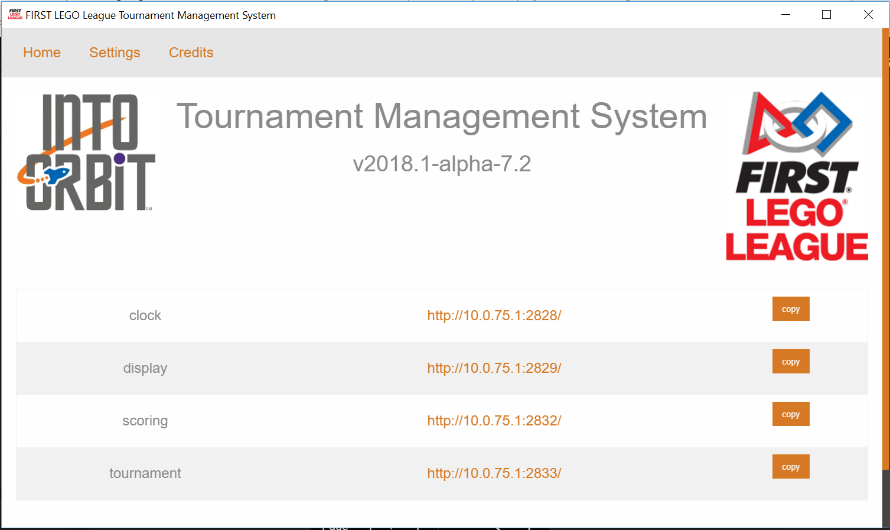
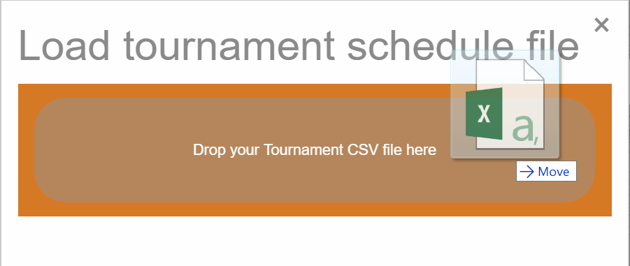
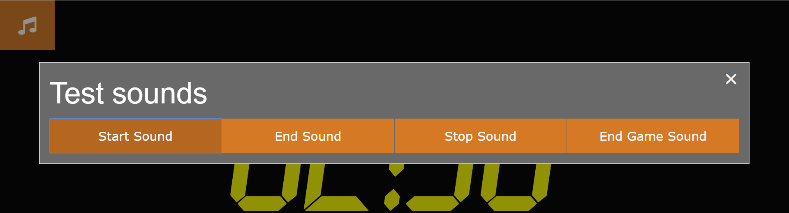

# *FIRST* LEGO League TMS User Guide

This guide is intended to give a brief overview of how to use the Tournament Management System.

## Overview

Even though this is called a Tournament Management System, currently it only provides scoring functionality. Additional features are planned for the future.

The system is made up of a number of components that we call modules. Each module implements a specific function. All modules except the launcher are displayed through your computer's default browser.  

Note: Currently we only support the Chrome browser.

### Hardware required

The software can be run entirely on one laptop (for small, low resourse competitions) through to larger installations with multiple scorekeeper computers, a separate results display computer and head referee/field manager computer. If a wireless router is available, referees can do score input using iPads or tablets. See [Network Configuration](#Network-Configuration)

### Computer requirements

The computer on which the software is installed should be an Intel I5 with 8GB of memory, or better. Approximately 1.5 GB of disk space is required. The other computers (scorekeepers, timer, results display) only need to run a browser and therefore have mimimal hardware needs.

### Modules

1. [**Launcher:**](#Launcher) provides a panel through which the user opens the other modules. Module configuration is done from the launcher.
1. [**Tournament:**](#Tournament) loads tournament Schedule file or Team List and provides tournament-wide configuration options.
1. [**Scoring:**](#Scoring) provides score entry and management. The referee or scorekeeper selects a team (loaded in `Tournament`) and round, and records missions completed by the team's robot. After the score has been submitted it can be viewed in a searchable list containing all the scores.
1. [**Results Display:**](#results-display) shows the team's match results.
1. [**Timer:**](#Timer) starts and displays the match timer.
1. [**Tournament Status Display:**](#) (not completed yet) shows whether the tournament is running ahead or behind schedule, and also shows the "next up" teams.

## Launcher

 

### Home

The `Home` screen is used to open the modules in the browser.  
For example, click the `Clock` (timer) link to open the `Timer`. You can also press the `copy` button to copy the module address, and then paste it into the browser address bar. Do this when your default browser is not Chrome.

### Settings

Module configuration is accessed through the `Settings` screen.

  

**clock**  
Timer settings - display countdown in minutes:seconds from 2:30 or in seconds from 150. 

**display**  
Results Display - No settings

**identity-provider**  

Note: this will be renamed  

Set `passwords` for the four predefined `roles`.

Press `Change` to set a new password. Press `Save` to make the change  permanent.

**rankings**  
Configure whether negative scores are shown as 0 on the `Results Display`. Default is YES. 

Note: The Scoring screen (intended for the Head Referee) shows negative scores when present.

**scoring**  
Configure the `Scoring` module settings.
- Select the scoresheet `Challenge` and language.
- `Require a referee` selects whether a referee name is required on a scoresheet. Default: YES
- `Auto-publish` - When configured to YES scores will be send to the `Results Display` as soon as the referee or scorekeeper presses the `Submit` button. If configured to NO the scores must be published, usually by the scorekeeper. Default: YES. See [link]
- `Require a Table` selects whether a table name is required on a scoresheet. Default: YES
- `Require a Signature` selects whether the scoresheet must be signed before it can be submitted. Usually when the scoresheet is completed by the referee the team technician will be required to sign the scoresheet. A signature is usually not required when a scorekeeper enters the mission information. Default: YES.
- `Display zero mission results` selects whether `0` is shown on the scoresheet when the team robot has not succeeded in completing a mission: Default: NO  

**tournament**  
`Tournament module` - No settings

## Login
Access to the module screens are password protected. There are 4 predefined roles: admin, scorekeeper, referee and MC.
- `admin` - tournament administrator or head referee
- `scorekeeper` - transfers missions completed from paper scoresheets into the digital scoresheets. Can also view all scores entered so far.
- `referee` - Records the state of the robot game on a digital scoresheet. Usually used on iPads or tablets.
- `MC` - tbd

When you login with a role (username) and password, that role is valid for all tabs opened in the browser. If you open an Incognito tab or a different browser, you can login again using a different role.

## Tournament
The `Tournament` screen is the place where the tournament organizer or head referee configures the tournament.

The first step is to import a schedule file or team list. Click `Import` on the right and select to import a `Schedule File` or `Team List`

- `Schedule file` - Import a CSV schedule file that follows the format used by Brian Lee's Scheduler excel file. This file contains team numbers and names as well as the tournament matches time schedule. 
- `Team List` file - Import a plain CSV team list. The file must have the team number, team name and general information in the first 3 columns. As this file does not contain match information, system features that require this data will be unavailable when a `Team List` is imported.    

Drag and drop a schedule file or team list onto the popup.

Verify that the information looks correct and then press `Upload`.

Once you have imported the file you can see all the imported information by pressing the `Teams` and `Matches` buttons. 

(current bug: you might have to refresh the screen by pressing the F5 button to see the teams or matches).

### Teams
The `Teams` screen enables you to edit the team name and affiliation, and to delete a team. You cannot change the team number. There is also a `Add Team` button. Be sure not to give a team number that is already used.

### Matches
The `Matches` screen shows all the match information.

You can edit match information or delete a match. You can also add a match or add, delete or rename the tables. Be careful not to enter conflicting data.

In a later version there will be support for searching the Teams and Matches screens.

### Images
The sponsor logos shown on the `Results Display` ribbon are configured here.

The four *FIRST* LEGO League global sponsors are preloaded. You can add additional images files by pressing the `Add Image` button. Press the `Delete` button on an image file to remove it.

A later version will support hiding logos that you do not want to be displayed but that you wish to keep.

Further configuration options are available in the `Tournament Settings` screen.

- Use the `Stage` dropdown to set the current stage of the tournament. Most tournaments have `practice` and `ranking` stages. When you import a `Schedule File` the stage names are take from the file. Default stage names are used if you import a `Team List`. Press the `Save` button after changing the stage. If scores have already been entered for the new `Stage` they will appear on the `Results Display`.
- Use the `Delete` button to delete the Teams and Matches. The system will verify that there are no team scores before deleting teams or matches. You delete scores in the `Scoring` module.
- The `Tournament Title` shown on the `Results Display` is configured here.
## Scoring
The `Scoring` module is used by the `Referee` or `Scorekeeper` to complete a scoresheet and by the `Head Referee` or `Scorekeeper` to manage the scores already entered into the system.
### Scoresheet
The scoresheet text follows the official scoresheet exactly.

- `Select Team` - Choose the team to score. Once you have selected a team you select the `Round`.
- `Select Round` - Select the `Round` to score. If you imported a Schedule CSV file in `Tournament` then the matches and rounds are taken from there. Rounds for which a score has already been entered are indicated by a tick mark.
- `Points` shows the accumulated points of missions scored so far.
- `Default` sets all the unscored missions to their default (usually unscored) value. This shortcut can be used when a team has succeeded in only a few missions - score those missions and then press `Default` to rapidly complete the rest. This option is not available when the referee role is logged in since the referee is required to go over all the missions with the team technicians.
- `Reset` - reset the scoresheet to it's unscored state.
- `?` - Show the mission text.

As you click each mission condition, the system checks for consistency. For instance, in the 2018 challenge `INTO ORBIT - M05 Extraction` mission, the `Gas Core Sample` cannot be both in the `Lander's Target Circle` and in `Base`. 

Once all the scoring requirements of a mission have been marked, the mission score value is shown, and the accumulated points are updated. The page automatically scrolls to the next mission.

If you get to the end of the scoresheet without having marked all the missions you will see a red `Some missions are incomplete` notification.

Click the notification to jump to the first incomplete mission. You will also be notified if the `Team` or `Round` has not been selected.

The team signs the scoresheet in the space provided, and then press `Submit`. You will see a `Score saved successfully` message.

### Score management screen

Press the menu icon to open the `Score management` screen.  

- **Search scores** - enter text to filter scores shown. Examples:  
  - `practice` - show all practice scores
  - `ranking #2` - show all scores in round `ranking 2`
  - `#62` - show all scores of team 62
  - `#7` - show all scores of teams with team numbers that start with 7. Add a space after the number 7 to show only scores for team 7
  - `Table 3` - show all scores on `Table 3`
- `Delete all scores` deletes all scores on the system. You will be asked to confirm. **Note that is permanent and deleted scores cannot be recovered**.
- `Download rankings` downloads all the ranking scores to a CSV file that can be used by Judging-Lite. Note that currently we only support export of `ranking` scores and not `practice` scores.

### Scoring tiles
All the information relating to a particular score is shown in scoring tile.  
#### Scoring tile  

- `Team number and name` - change the team to which this score is assigned
- `Round` - change the `round` to which this score is assigned
- `Score` - change the `score` for this match. Note that if you do this the score will not be alligned with the scoresheet.
- `referee` and `table` - change the `referee` and `table`. Currently only the referee role sets this information.
- `Edit scoresheet` - open the scoresheet for editing. `Scorekeepers` use this to verify that scores entered by the `referee`.
- `Publish / Unpublish` - publishing (`+`) a score causes it to appear in the `Results Display`. Unpublishing (`-`) causes the score not to appear in the `Results Display`. Note: when you see the `-` symbol that means the score is published.
- `Delete` - delete a score. You will be asked to confirm. **Note this is permanent and a deleted score cannot be recovered**.

#### Duplicate scores

The `Show only duplicates` button is shown when more than one score is submitted for the same team and round. Clicking the button filters out all scores that are not duplicate. This gives the head referee or scorekeeper the opportunity to check for duplicates from time to time, and to correct the error.

`Show only bad scores` button - TBD

## Results display

TBD

## Timer

The `Timer` (clock) is used to start matches and provides a 2:30 minute countdown timer.

There are 3 options
- Start the timer
- Reload the timer - resets the timer to 2:30 minutes
- Stop the timer - does an automatic reload

The musical note in the top left hand corner of the screen is used to test the four sounds.

## Tournament Status Display

TBD

## Network Configuration

At a larger tournament you might have four computers connected to each other using a router. We recommend that the connections to the router be wired connections rather than WiFi, especially in school environments where there could very well be other WiFi networks.

### Use of iPads and tablets

We have done limited testing of score input using iPads and WiFi. No problems were encoutered. If there is a temporary loss of connectivity when the scoresheet is submitted, the results are saved locally in the iPad, and are sent again together with the submit of the subsequent scoresheet.  
**Note:** Additional functionality has been added since the above testing. Therefore tournaments that intend using iPads should coordinate this with the development team.

## Todos

1. Add internal links in document
1. Diagram of configuration
1. Show only bad scores
1. Results Display
1. Tournamet Status Display
1. email address for comments
1. logs and debugging
1. Network cards