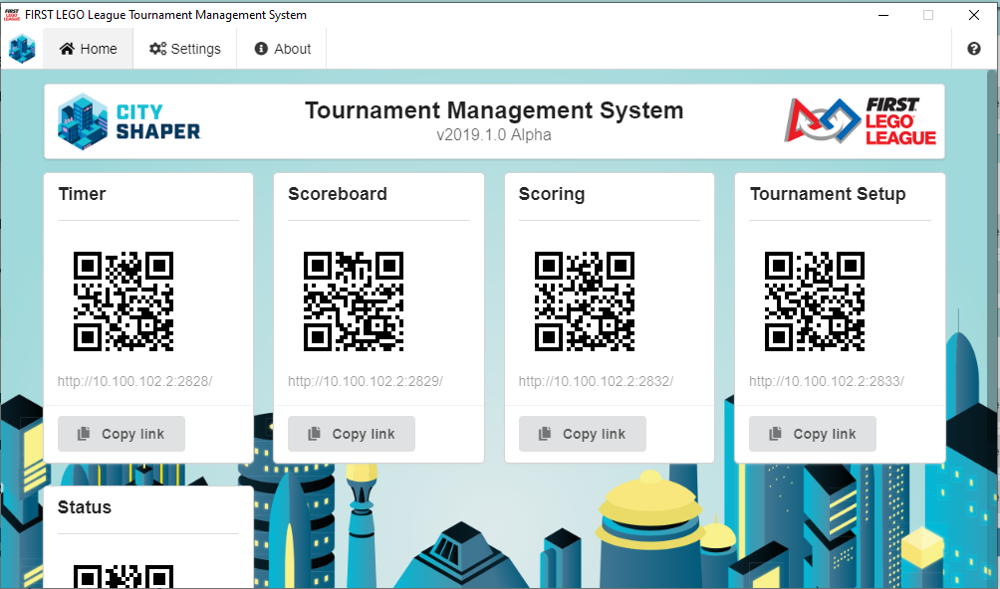
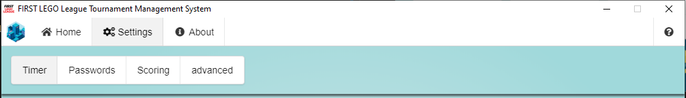
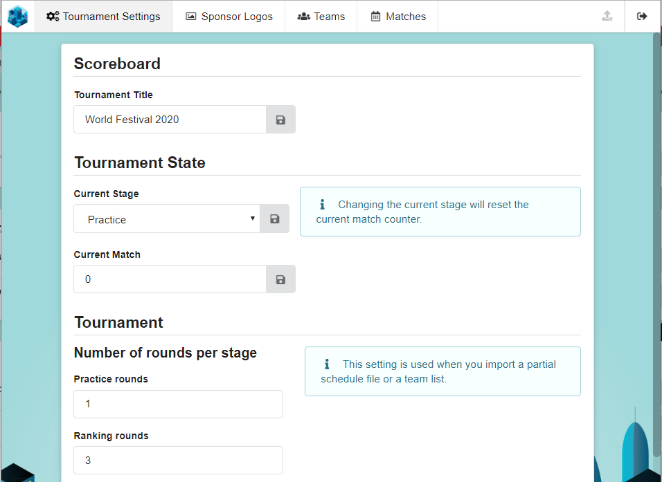
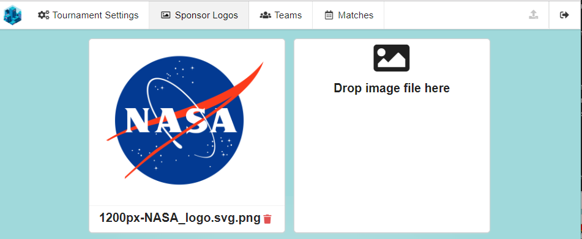
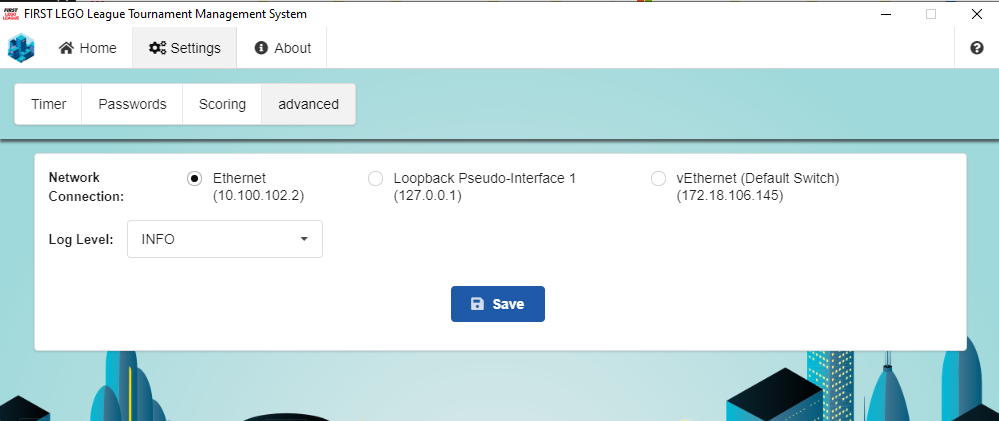

# *FIRST* LEGO League TMS User Guide

This guide is intended to help *FIRST* LEGO League tournament orgnizers use the Tournament Management System (TMS).

## Overview

The Tournament Management System is an application that enables *FIRST* LEGO League tournament organizers to record robot game mission results on an digital scoresheet and to display the match results on a scoreboard.

The system is made up of a number of components which we call modules. Each module implements a specific function. All modules, except the launcher, are displayed through your computer's default browser.  

Note: Currently we only support the Chrome browser.

This software is the result of volunteer efforts by groups in The Netherlands, Israel and the USA.

### Hardware required

The software can be run entirely on a single laptop (for small, low resourse competitions) through to larger installations with multiple scorekeeper computers, a separate scoreboard display computer and head referee/field manager computer. If a wireless router is available, referees can do score input using iPads or tablets. See [Networked Computers](#networked-computers)

### Computer requirements

The computer on which the software is installed should be a Windows Intel I5 with 8GB of memory, or better. Approximately 1.5 GB of disk space is required. The other computers (scorekeepers, timer, scoreboard display) only need to run a browser and therefore have mimimal hardware needs.

Note: Currently we only support 64-bit computers. We are working to extend support to older 32-bit computers.

### Installation

To upgrade this software with a new version, run the setup file without uninstalling the previous version first. Existing configurations and team scores will be preserved.

When running the software for the 1st time, you might get a message regarding the Windows Defender Firewall. Press `Allow Access` for the software to work properly.

The software currently supports 64-bit computers only. When we extend support to 32-bit computers, there will be two separate Setup files.

### Modules

1. [**Launcher:**](#launcher) provides a panel through which the user opens the other modules. Module configuration is done from the launcher.
1. [**Tournament Setup:**](#tournament) loads tournament Schedule file or Team List and provides tournament-wide configuration options.
1. [**Scoring:**](#scoring) provides score entry and management. The referee or scorekeeper selects a team (loaded in `Tournament`) and round, and records missions completed by the team's robot. After the score has been submitted it can be viewed in a searchable list containing all the scores.
1. [**Scoreboard:**](#scoreboard) shows the team's match results.
1. [**Timer:**](#timer) starts and displays the match timer.
1. [**Tournament Status Display:**](#tournament-status-display) (not completed yet) shows whether the tournament is running ahead or behind schedule, and also shows the "next up" teams.

## Quick Start

If you don't have time to read this whole guide or you need just to know the steps to get going, this paragraph is for you.

1. Start the `Launcher`
1. Open the Tournament Setup page
    1. Set your Tournament name (Tournament Settings / Tournament Title / Save)
    1. Add your sponsor logos (Images / Add Image)
    1. Load the schedule file or team list (Import / Import Schedule file)
1. Open the Scoreboard page
1. Open the Timer page
1. Open the Scoresheet (click `Scoring`)

## Launcher

The `launcher` is used to open and configure the TMS modules.

 

### Home

The `Home` screen provides clickable links to open the modules, each in it's own browser tab.
For example, click the `Timer` or it's ip address to open the `Timer`. You can also press the `Copy link` button to copy the module address, and then paste it into the browser address bar. Do this when your default browser is not Chrome.

### Settings

Module configuration is accessed through the `Settings` screen.

  

**Timer**  
Timer settings - display countdown in minutes:seconds from 2:30 or in seconds from 150.

**Passwords**

Set `Passwords` for the four predefined `roles`. See [Login](#login) for a description of the roles.  
Press `Save` to make the change permanent.

**Scoreboard**  
Configure whether negative scores are shown as 0 on the `Scoreboard`. Default is YES.

Note: The Scoring screen (intended for the Head Referee) will still show negative scores.

**Scoring**

Configure the [Scoring](#scoring) module settings.

- Select the scoresheet `Challenge` and language.
- `Require a referee name` selects whether a referee name is required on a scoresheet. Default: YES
- `Auto-publish team scores` - When configured to YES, scores will be sent to the `Scoreboard` immediately when the referee or scorekeeper presses the `Submit` button. If configured to NO the scores must be [manually published](#scoring-tile), usually by the scorekeeper. Default: YES.
- `Require a Table` selects whether a table name is required on a scoresheet. Default: YES
- `Require a team signature` selects whether the scoresheet must be signed before it can be submitted. Usually when the scoresheet is completed by the referee, the team technician will be required to sign the scoresheet. A signature is usually not required when a scorekeeper enters the mission information. Default: YES.
- `Display mission score if zero` selects whether `0` is shown on the scoresheet when the team robot has not succeeded in completing a mission: Default: NO  

Press `Save` to make the change permanent.

Note: After making a change to one of the above settings you need to refresh the browser `Scoring` tab.

**Advanced**

Configure the software logging level and Network Adaptor.

**About**

Information about this software, including how to contact the developers.

**Help**

Show this document

## Login

Access to the module screens are password protected. Each of the 4 predefined roles (admin, scorekeeper, referee and mc) has it's own password.

- `admin` - tournament administrator or head referee. Default password: admin
- `scorekeeper` - transfers missions completed from paper scoresheets into the digital scoresheets. Can also view all scores entered so far. Default password: scorekeeper
- `referee` - Records the state of the robot game on a digital scoresheet. Usually used on iPads or tablets. Default password: referee
- `mc` - Default password: mc

A password cannot be recovered after it has been saved.

When you login with a role (username) and password, that role is valid for all tabs opened in the browser. If you open an Incognito tab or a different browser, you can login again using a different role.

## Tournament

The `Tournament` screen is the place where the tournament organizer or head referee sets up the tournament.

### Tournament Settings

The `Tournament Settings` screen is where you configure general settings for the tournament.

- Use the `Stage` dropdown to set the current stage of the tournament. Most tournaments have `practice` and `ranking` stages. When you import a `Schedule File` the stage names in the file are used. Default stage names are used if you import a `Team List`. Press the `Save` button after changing the stage. If scores have already been entered for the new `Stage` they will appear on the `Scoreboard`.
- `Delete Tournament Data` - Use the `Delete` button to delete the Teams and Matches.  You will be asked to confirm. **Note this is permanent and deleted scores cannot be recovered**. The system will verify that there are no team scores before deleting teams or matches. You delete scores in the `Scoring` module.
- The `Tournament Title` shown on the `Scoreboard` is configured here.

### Images

The sponsor logos shown on the [Scoreboard](#Scoreboard) ribbon are configured here.

The four *FIRST* LEGO League global sponsors are preloaded. You can add additional images files by pressing the `Add Image` button. Press the `Delete` button on an image tile to remove it.

Note: A later version of this software will support hiding logos that you do not want to be displayed but that you wish to keep.

### Import team data

The next step is to import a schedule file or team list. Click `Import` on the right of the screen and select to import a `Schedule File` or `Team List`

Note: `Import` is only available when the team list is empty.

- `Schedule file` - Import a CSV schedule file that follows the format of the Tournament Scheduler Excel spreadsheet. This file contains team numbers and names as well as the tournament matches time schedule.
- `Schedule file - shortened` - Import a CSV schedule file exported from one of the Excel-based `Team Tournament Schedule Templates` in the [Tournament Manual](https://firstlegoleague-eventmanuals.pbworks.com/w/page/85093483/Chapter%209%20Home%20Page). The templates can be downloaded from the [Wiki](https://firstlegoleague-eventmanuals.pbworks.com/w/browse#view=ViewFolderNewGui&param=2017%20Schedule%20Templates). Since these CSV Export files do not contain match information, system features requiring this data will be unavailable.
- `Team List` file - Import a plain CSV team list. The file must have the team number, team name and general information in the first 3 columns. As this file does not contain match information, system features requiring this data will be unavailable.

Drag and drop a schedule file or team list onto the popup.

Verify that the data looks correct and then press `Import`.

Once you have imported the file you can see all the imported data by pressing the `Teams` and `Matches` buttons. 

If you need to replace the imported data with a different CSV file, you can delete all the teams and matches, and import again. See [Tournament Settings](#tournament-settings) - `Delete Tournament Data`.

### Teams

The `Teams` screen enables you to edit the team name and affiliation, and to delete a team. You cannot change the team number. There is also a `Add Team` button. Be sure not to use a team number that is already taken. Note that a newly added team does not immeditaly apear - you must refreshthe browser or switch to a differet screen (such as 'Matches') and then back here to see a newly added team.

### Matches

The `Matches` screen shows all the match information.

You can edit match information or delete a match. You can also add a match or add, delete or rename the tables. Be careful not to enter conflicting data.

Note: A later version of this software will provide support for searching the Teams and Matches screens.

## Scoring

The `Scoring` module is used by the `Referee` or `Scorekeeper` to complete a scoresheet and by the `Head Referee` or `Scorekeeper` to manage the scores already entered into the system.

### Scoresheet

The scoresheet text follows the official scoresheet exactly.

- `Select Team` - Choose the team to score. After selecting a team, you select the `Round`.
- `Select Round` - Select the `Round` to score. Rounds for which a score have already been entered are indicated by a tick mark.
- `Points` shows the accumulated points of missions scored so far.
- `Default` sets all the unscored missions to their default (usually unscored) value. This shortcut may be used when a team has successfully done only a few missions - score those missions and then press `Default` to rapidly complete the other missions. This option is not available when the referee role is logged in since the referee is required to go over all the missions with the team technicians.
- `Reset` - reset the scoresheet to it's unscored state.
- `?` - Show the mission description.

As you click each mission condition, the system checks for consistency. For instance, in the 2018 challenge `INTO ORBIT - M05 Extraction` mission, the `Gas Core Sample` cannot be both in the `Lander's Target Circle` and in `Base`.

Once all the scoring requirements of a mission have been marked, the mission score value is shown, and the accumulated points are updated. The page automatically scrolls to the next mission.

If you get to the end of the scoresheet without having scored all the missions, you will see a red `Some missions are incomplete` notification.

Click the notification to jump to the first incomplete mission. You will also be notified if the `Team` or `Round` has not been selected.

The team signs the scoresheet in the space provided, and then press `Submit`. You will see a `Score saved successfully` message.  
Note: [Require a Signature](#settings) is configurable in the Settings.

### Score management screen

Press the menu icon on the top left of the `Scoresheet` to open the `Score management` screen.  

- **Search scores** - enter text to filter which scores are shown. Examples:  
  - `practice` - show all practice scores
  - `ranking #2` - show all scores in round `ranking 2`
  - `#62` - show all scores of team 62
  - `#7` - show all scores of teams with team numbers that start with 7. Add a space after the number 7 to show only scores for team 7
  - `Table 3` - show all scores on `Table 3`
- **Delete all scores** deletes all scores on the system. You will be asked to confirm. **Note this is permanent and deleted scores cannot be recovered**.
- [**Download rankings**](#tournament-settings) downloads the  scores to a CSV file that can be used by Judging-Lite. Note: When the `Stage` in `Tournament Settings` is set to `practice`, those scores are exported. When it is set to `ranking`, ranking scores are exported.

### Scoring tiles

All the information relating to a particular score is shown in a scoring tile.  

#### Scoring tile  

- `Team number and name` - change the team to which this score is assigned
- `Round` - change the `round` to which this score is assigned
- `Score` - change the `score` for this match. Note: if you do this, the score will no longer be the same as the accumulated score on the scoresheet.
- `referee` and `table` - change the `referee` and `table`. Note: Currently only the referee role sets this information.
- `Edit scoresheet` - open the scoresheet for editing. `Scorekeepers` may use this to verify the scores entered by the `referee`.
- `Publish / Unpublish` - publishing (`+`) a score causes it to appear in the `Scoreboard`. Unpublishing (`-`) causes the score not to appear in the `Scoreboard`. Note: The `-` symbol that means the score is published, `+` means it is unpublished.
- `Delete` - delete a score. You will be asked to confirm. **Note this is permanent and a deleted score cannot be recovered**.

#### Duplicate scores

The `Show only duplicates` button is enabled when more than one score has been submitted for the same team and round. Clicking the button filters out all scores that are not duplicates. This gives the head referee or scorekeeper a way to easily check for duplicate scores, and to correct the error.

The `Show only bad scores` button is shown when scores cannot be sent to the `Scoreboard` for any reason. (Details TBD)

## Scoreboard

The `Scoreboard` shows the team scores for the current stage.

Before any scores have been entered, teams are ordered by team number. (currenly there is a bug on this).

When there are scores for a single round only, they are shown in a `Score` column. For example, during the Practice round and also during the 1st Ranking round, only one column is shown.

When there are scores for multiple rounds, there will be a `High` column containing the team's best score, followed by a column for each round.

The left-most column shows the team's rank. The rank is taken from the `High` score. Ties are broken using 2nd, then 3rd best scores.

The `Scoreboard` continuously scrolls through all the teams.

The tournament title is configured in the [Tournament Settings](#tournament-settings) screen.

The sponsor logos ribbon is configured in the [Tournament Images](#images) screen.

## Timer

The `Timer` (clock) is used to start matches and provides a 2:30 minute countdown timer.

There are 3 action buttons

- Start the timer
- Reload the timer - resets the timer to 2:30 minutes
- Stop the timer - does an automatic reload

The musical note in the top left hand corner of the screen is used to test the four sounds.

The timer can be activated on any computer or tablet on the network. The sound files are played only on the computer where the TMS is installed and this computer must be connected to to a loudspeaker system if required.

## Tournament Status Display

This display shows whether the tournament is running ahead of schedule or behind schedule. It also shows the teams that will play in the upcoming two matches.  
Note: This display only works when a [schedule file is imported](#tournament).
Note: Not implemented yet.

## Networked Computers

At a larger tournament you might have a number of computers connected to each other using a router. We recommend that the connections to the router be wired connections rather than WiFi, especially in school environments where there might be other WiFi networks.

### Use of iPads and tablets

We have done limited testing of referee score input using iPads and WiFi. No problems were encoutered. If  there is a temporary loss of connectivity when the scoresheet is submitted, the results are saved locally in the iPad, and are sent again together with the submit of the subsequent scoresheet.  
**Note:** Additional functionality has been added since these tests. Tournament organizers that intend using iPads should coordinate this with the development team.

## Network adapters

Many laptop PCs have more than one `Network adapter`. For instance, there might be a wired RJ45 adapter and a WiFi adapter. If you have multiple computers in a network you must ensure the TMS is configured to use the correct adapter. This is done in the `Launcher Settings Network Connections` screen.

## Log files

The software records activities in logfiles. When reporting a bug please attach these logs. The logs may be collected into a .ZIP file by pressing the `Logs` button at the bottom of the `Launcher Home` screen.

Logging should be set to DEBUG.

Note: When reporting a bug please include the software version which can be seen in the Home screen of the [Launcher](#launcher).

## Feedback

Please send comments/suggestions/questions about this document to Alan Green at agreen@firstinspires.org

## Known Issues

1. 32-bit computers not supported
1. After making changes to the scoring settings in the Launcher, the Scoring browser tab needs to be refreshed (press F5)

## Todos

1. Diagram of configuration
1. Tournamet Status Display
1. Define MC role
